# Olá! Eu sou João👋

Gosto de desenvolvimento de baixo nível em Java e C/C++, e me interesso por onde a computação encontra outras ciências — especialmente física, genética e neurociência. Fora do código, treino artes marciais.

* 🎓 **Engenharia de Computação UTFPR-TD**
* 📫 **Contatos:** [LinkedIn](https://www.linkedin.com/in/jo%C3%A3o-pedro-cunha-guska-7378b5168/) | [Instagram](https://www.instagram.com/jp.guska/)

---

## 📊 GitHub Stats

  

---

## 💻 Linguagens e Ferramentas

**Linguagens:**

<!-- START_SECTION:langs -->

<!-- END_SECTION:langs -->

**Ambiente, Infraestrutura & Frameworks:**

---

## 📂 Portfólio

<!-- START_SECTION:repos -->
* **[pong-neat](https://github.com/jpguska/pong-neat)**: IA que joga Pong evoluída via NEAT (NeuroEvolution of Augmenting Topologies). Entrega da 2ª Competição de IA PPCI 2025.
* **[cryptopals-challenges](https://github.com/jpguska/cryptopals-challenges)**: Soluções para os desafios de criptografia do Cryptopals.
* **[java-hsm-crypto-examples](https://github.com/jpguska/java-hsm-crypto-examples)**: Integração criptográfica com HSMs da Dinamo Networks.
* **[chemye-compiler](https://github.com/jpguska/chemye-compiler)**: Compilador da linguagem Chemye++ focado nas etapas de análise léxica e sintática. Tem como base a linguagem C++.
* **[crud-transporte-gov](https://github.com/jpguska/crud-transporte-gov)**: CRUD de transporte público implementado de duas formas: Sockets TCP com protocolo binário e RMI com Pyro5. Trabalho de Sistemas Distribuídos.
* **[GLC](https://github.com/jpguska/GLC)**: Sem descrição.

<!-- END_SECTION:repos -->

---
